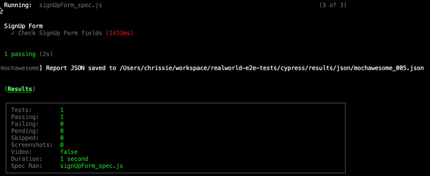
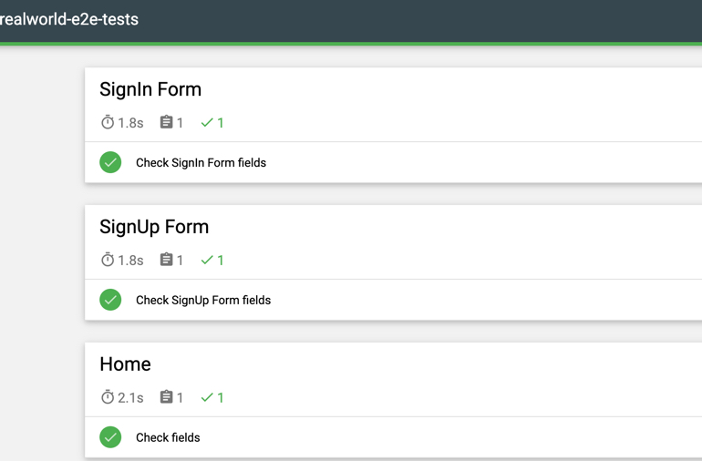

# realworld-e2e-tests

## Test reports

Multiple test reports are set up for the Cypress tests.

- Terminal report when executing the Cypress tests.
  

- MochAwesome HTML report. Report is build with `yarn report:all` and you can find it locally under `cypress/reports/html/mochawesome-bundle.html`
  

- During a test run for each test spec Xml files are created under `dylan/data/test/cypress/results`.

Under `reporter-config.json` you can find all settings for the test report. More information to the reporter options are [here](https://docs.cypress.io/guides/tooling/reporters.html).
